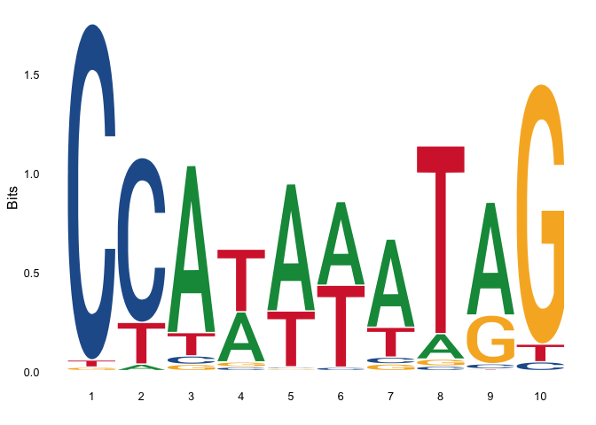

<!-- README.md is generated from README.Rmd. Please edit that file -->

# CNVMotif

<!-- badges: start -->


[](https://codecov.io/gh/ShixiangWang/CNVMotif?branch=master)
<!-- badges: end -->

The goal of CNVMotif is to explore, analyze and visualize the copy
number variation (CNV) motifs in cancer genomics.

## Installation

~~You can install the released version of {CNVMotif} from
[CRAN](https://CRAN.R-project.org) with:~~

``` r
install.packages("CNVMotif")
```

And the development version from [GitHub](https://github.com/) with:

``` r
# install.packages("devtools")
devtools::install_github("ShixiangWang/CNVMotif")
```

## Example

``` r
library(CNVMotif)
library(ggseqlogo)
#> Warning: package 'ggseqlogo' was built under R version 4.0.1
data(ggseqlogo_sample)

## Same as ggseqlogo()
p1 <- ggseqlogo2(seqs_dna[[1]])
p1
```



``` r

## Extra feature
idor <- as.character(1:4)
names(idor) <- c("A", "C", "G", "T")
p2 <- ggseqlogo2(seqs_dna[[1]], idor = idor)
p2
```


